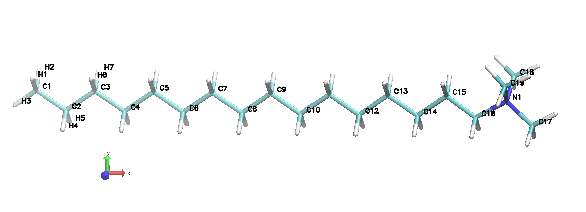

# Cluster

Trace the clusters formed in the simulation cell based on close contact analysis preformed with Voronoi tesselation as implemented in [voro++](http://math.lbl.gov/voro++/) and its python bindings [pyvoro](https://github.com/joe-jordan/pyvoro).

To access detailed help use:

    pysimpp cluster -h

## Example

Assume that you want to post process a molecular dynamics (MD) trajectory of surfactant’s aqueous solution, produced by gromacs. In this example, the specific system consists of the CTAC (cetyltrimethylammonium chloride, illustrated in [Fig. 1](./ctac.jpg)), CL (chloride ion), and SOL (water solvent) molecules and it is found at the micellar phase (L1). The trajectory file is named npt.xtc while the topology file is named npt.tpr.

<!-- |  |
|:----------------------------------------------------------| -->
|  |
|:----------------------------|
| **[Fig. 1](./figures/ctac.jpg)**: The molecular model for CTAC. The atomic units of carbon, nitrogen, and hydrogens are colored cyan, blue, and white, respectively. |

The cluster command can be used to trace and analyse the micelles formed in the simulation cell. There is no need to run the pysimpp form the simulation directory. You just have to use the path (absolute or relative) for the files provided in the arguments. For simplicity, in the following is assumed that the script runs from the simulation directory where all the required files reside. The output files are always written in the directory where the trajectory file resides.

### Elementary

To perform the clusters analysis, two arguments required: a) the molecular species forming the clusters are provided in a comma separated list with the `-molname` argument, and b) the radii of the atoms in the system are provided in a file given in the `-radii` argument (see [here](#radii-file-format) ).

Therefore, the simplest command to trace the clusters (micelles) formed by CTAC in the simulation cell, is:

    pysimpp cluster -molname CTAC -radii radii.txt ./npt.xtc

The following files will be written in the simulation directory:

- `cnumber.dat` : time evolution of the number of clusters in the simulation cell.

- `cmolecules.dat` : time evolution of the number of molecules per molecular species in the clusters.

- `hclnumber.dat` : histogram of the number of clusters.

- `hclsize.dat` : histogram of the size of clusters, measured as the number of constituent molecules.

- `properties.dat` : time evolution of the mean clusters' properties and their standard deviations. The properties' list includes, the aggregate number (*N*<sub>agg</sub>), the radius of gyration (*R*<sub>g</sub><sup>2</sup>), the asphericity (*b*), the acylindricity (*c*), and the relative shape anisotropy (&lt;*κ*<sup>2</sup>&gt;) of the cluster; the corresponding keys in the header of the files are `nagg`,  `sqrg`,  `b`,  `c` , and `sqk`, respectively.

- `details.dat` : time evolution of the clusters' properties and their standard deviations per frame. For each frame, the properties of a cluster are listed in a separate line. The cluster's properties include, infinit periodic flag, number of molecules (*N*<sub>agg</sub>), linear density (*ρ*<sub>L</sub>), bounding box's edges, gyration tensor **S** and its eigenvalues, ordering tensor **Q** and its eigenvalues; the corresponding keys in the header of the files are `isinf`, `nagg`, `ldens`, `bboxl`, `srvec`/`srval`, and `qvec`/`qval`, respectively. The latter will be reported only if the `-ends` option is provided ( [see below](#order) )

### Accelerate

If specific atoms are not important for tracing the close contacts between clusters' molecules, they can be excluded from the Voronoi tesselation reducing the computational load significantly. In our example, the hydrogen atoms can be safely excluded passing to the `-excluded` argument a comma separated list with their types:

    pysimpp cluster -molname CTAC -radii radii.txt -excluded HGA2,HGP5,HGA3,HT ./npt.xtc

### Refine

In several occasions, it make sense to use only a part of the constituent molecules to trace their assemblies. In our example, we can a part of the aliphatic chain near its free end, by providing to the `-specific` a comma separated lists of their name:

    pysimpp cluster -molname CTAC -radii radii.txt -specific C1,C2,C3,C4,C5 -excluded HGA2,HGP5,HGA3,HT ./npt.xtc

This fragments are usually traced in the skeleton of the micelles. In this way, difficulties related to isolated molecules that are largely exposed in water are avoided. These unimers are “floating” between two different assemblies and drive the algorithm to identify them as one.

Be aware that if none of the atoms in the system are excluded, in the `-specific` argument, the hydrogens connected to the given carbon atoms should also be provided:

    pysimpp cluster -molname CTAC -radii radii.txt -specific C1,C2,C3,H1,H2,H3,H4,H31,H32,H33 ./npt.xtc

otherwise the CTAC molecules will be considered to be isolated since the hydrogen atoms will be considered in the Voronoi tesselation and no close contacts will be traced between the carbon atoms considered.

### Order

If the end atoms of the molecular species defining the clusters' constituent moleculce are provided in the `-ends` option:

    pysimpp cluster -molname CTAC -radii radii.txt -specific C1,C2,C3,H1,H2,H3,H4,H31,H32,H33 -ends CTAC:1,16 ./npt.xtc

then the configuration properties of these species and their shape factors will be calculated together with properties indicative of the orientation order in the system. The following files will be written in the simulation directory:

- `molecular.dat` : time evolution of the mean properties of the molecules participate in the clusters, per molecular species and frame. The properties include, the number of constituent molecules, the square end-to-end distance (&lt;*R*<sup>2</sup>&gt;), the radius of gyration, the asphericity, the acylindricity, and the relative shape anisotropy of the molecules; the corresponding keys in the header of the files are `n`, `sqee`, `sqrg`, `b`, `c`, and `sqk`, respectively.

- `order.dat` : the time evolution of the mean values and their standard deviations of several properties used as measures for estimating the orientational order in the system. The properties include the local order (*q*), order parameter (*S*), and the order tensor and its eigenvalues, calculated based on the eigenvectors of clusters' gyration tensor **S** corresponding its larger eigenvalue; the corresponding keys in the header of the files are `qlocal`, `qlong`, and `dirval`/`dirvec`, respectively.

### Visualize

The clusters traced in the simulation cell, can be visualized if a visualization frequency is provided with the `-vis` option:

    pysimpp cluster -molname CTAC -radii radii.txt -specific C1,C2,C3,C4,C5 -excluded HGA2,HGP5,HGA3,HT -vis 100000 ./npt.xtc

In this case the snapshots of the clusters will be save in gro file under the `clusters` directory located in the simulation folder. The frequency value is timestep based for lammps and time based otherwise. The files are named as `clusterXXX_stepYYY.gro` where `XXX` is the number of the cluster and `YYY` is the timestep/time of the snapshot. The numbering of the clusters corresponds to their sort in acceding order based on their aggregation number. Therefore, it is possible that the same number correspond to different clusters in different frames.

### Properties

A number of properties' histograms for the molecular species and the clusters can be calculated by using `-phist` option. The argument is a comma separated list of property:<histogram bin> pairs and the output files are written in the simulation folder using the name `hXXX.dat` where XXX is the property name. The command:

    pysimpp cluster -molname CTAC -radii radii.txt -specific C1,C2,C3,H1,H2,H3,H4,H31,H32,H33 -ends CTAC:1,16 -phist b:0.05,sqrg:1.0 ./npt.xtc

will produce the file hb.dat and hsqrg.dat with teh histograms of asphericity and square radius of gyration of the clusters, respectively. The following properties are supported:

- b : asphericity (clusters/constituent species),

- c : acylindricity (clusters/constituent species),

- sqk : anisotropy (clusters/constituent species),

- sqrg : square radius of gyration  (clusters/constituent species),

- sqee : end-to-end distance (only for constituent species),

- bbox : bounding box (clusters/constituent species),

- qlong : global order, and

- qlocal : local order.

The property of a molecular species is named by appending "_{SPECIES SNAME}" at the property's name. For example, with rhe argument `c:0.01,c_CTAC:0.05`, the bin length of the acylindricity distribution of the clusters is set to 0.01 and for the CTAC molecules to 0.05. The special keywords `all`, `clusters`, and `species` can be given instead of a property's name. In this case, `all` the available properties, the properties of the traced `clusters`, or the properties of the molecular `species` will be calculated, respectively, and the corresponding histograms will be calculated.

### Molecular neighborhood 

For each of the clusters' forming molecular species, the histogram of the number of neighbors molecules per species, can be calculated by providing the `--nbhist` option. In our example, the histograms of the total number of `CTAC-CTAC`, `CTAC-CL`, and `CTAC-SOL` pairs will be calculated, and the corresponding output files will be written in the simulation directory (namely, `CTAC_CTAC_neighbors.dat`, `CTAC_CTAC_neighbors.dat`, and `CTAC_CTAC_neighbors.dat`, respectively).

### Moiety neighborhood 

The constitution of the local environment around molecular moieties can be explored using `-hist` option to calculate the histograms of the number of moieties' neighbor pairs. For example, the command to explore the number of CTAC, CL, and SOL molecules around the methyl group of the alkyl tail is:

    pysimpp cluster -molname CTAC -radii radii.txt -specific C1,C2,C3,C4,C5 -excluded HGA2,HGP5,HGA3,HT -vis 100000 -hist C1:CTAC:C1,H31,H32,H33:CTAC,CL,SOL ./npt.xtc

The argument defines the methyl group using the format `GROUPNAME:MOLNAME:ATOMSLIST:RESIDUESLIST`, where:
  - GROUPNAME:  the name of the group
  - MOLNAME:    the name of the species where the group belongs
  - ATOMSLIST:  a comma-separated list of atoms defining the group, and
  - SPECIESLIST: a comma-separated list with neighbor molecular species

The histograms will be written in file names GROUPNAME_SPECIES_neighbors.dat in the simulation directory, i.e., `C1_CTAC_neighbors.dat`, `C1_CL_neighbors.dat`, and `C1_SOL_neighbors.dat`. A "@" separated groups can be provided in the argument. For example, if you was to calculate also the number of CL anions around the head group, the argument becomes `C1:CTAC:C1:CTAC,CL,SOL@HEAD:CTAC:N,C17,C18,C19:CL`.

### Cluster structure

In the case where the clusters formed in the simulation cell are of spherical, rod-like, and/or cylindrical shape, the structure around their core can be explored by means of the radial number density profiles of certain moieties. These profiles are calculated with respect to distance from the center of mass for spherical shaped clusters, and with respect to the distance from the elongated axis of the cluster for the rest of the cases. The molecular moieties are provided as `@` separated list in the argument of `-profiles` option. Each group of atoms is given as `<group name>:<species name>:<atoms list>`. In our example, the argument `HEAD:CTAC:C17,N,C18,C19@WAT:SOL:OW` defines the groups `HEAD` that belongs to CTAC molecule and consists of `C17`, `N`, `C18`, and `C19` atoms, and `WAT` defined from the `OW` atom (oxygen) of `SOL` (water) molecules. For each group, the density profile will be written in the file `profile_<group name>_<shape>.prof` in the folder `profiles` located in the simulation directory. Three types of clusters' shape are considered:  spherical (`s`), cylindrical infinite periodic (`c`), and rod-like/elongated (`e`). Therefore file `HEAD_s.prof` and `WAT_s.prof` corresponds to the radial density profile of CTAC's head group and water, with respect to the center of sass for spherical clusters, respectively.

## Etc

### Radii file format

The radii's file should look like:

```term
types    d 1 
! name of the element, diameter (LJ sigma) in A
  CG321  1.00000000
  CG334  1.00000000
  CG331  1.00000000
  CG324  1.00000000
  HGA2   0.50000000
  HGP5   0.50000000
  HGA3   0.50000000
  NG3P0  1.00000000
  CLA    1.00000000
  HT     0.50000000
  OT     1.00000000
```

The first line contains the keywords `(elements|types)`, `(r|d)`, and `c`; the first, specifies the atom type identifier; the second, if the radius (`r`) or the diameter (`d`) is given for each type; and the third, specifies the column of the record for the radius or the diameter. The rest of the lines contain the (`type`, `radius`) pairs. The `types` could be either a number (e.g., the type id in lammps) or a string (e.g., type name in gromacs). **A type based radii file should be provided**.

## Arguments

### Positional arguments

`path`: the path to the simulation trajectory file. A topology file with the same based name should reside on the same directory, otherwise it should be provided with the `-topo` option.

### Options

- `-h, --help`:
show this help message and exit.

- `-start n` :
start processing form timestep n [inclusive] (step based for lammps and time based for gromacs).

- `-end n` :
stop processing at timestep n [inclusive] (step based for lammps and time based for gromacs).

- `-every n`: processing frequency (every n timesteps, step based for lammps and time based for gromacs).

- `-vis n`:
visualization frequency (save gro files for the traced clusters every n timesteps iteration based for lammps and time based for gromacs).

- `--whole`:
reconstruct the molecules making them whole again, before spatial reconstruction of the clusters. Use this option if the coordinates of the input trajectory are wrapped in to the simulation cell and you want to correctly visualize the clusters.

- `-molecules molid range`:
indexes of clusters' constituent molecules. A comma separated list with the ranges of molecules ids, e.g., `1,2,3` or `1:10,20,30:100`

- `-molnames <species' list>`:
types/names of clusters' constituent species. A comma separated list with the names of the molecules, e.g., `Na,Cl`

- `-ends <list of end atoms per species>`:
the pairs of atoms defining the end-to-end vectors of the molecular species participating in a cluster (see `-molnames`). For example, if the end-to-end vectors of clusters' constituent molecular types TIC and TOC are defined by atoms (1, 16) and (3,25), respectively, the arguments could be `TIC:1,16@TOC:3,25`.

- `-excluded <types' range>`:
the atom types to be excluded system wide from the close contact analysis. A comma separated list with the atoms' type name should be provided e.g. `HA,HW`.

- `-specific <list of atoms per species>`:
the names of the atoms to be considered in the close contact analysis. A comma separated list for each molecular species in the `-molnames` argument should be provided. If a wildcard `"*"` is given for a residue then all the atoms of the molecular species will be considered. For example, if A, and B are the clusters' constituent molecular types, the argument could look like `*:C1,C2,C3` specifying  that all the atoms of species A and only the atoms C1,C2,C3 of species B should be considered in the analysis.

- `-radii <file with atoms' type/element radii>`:
 the file with the radii of the atoms. It can be element or type based. The first line of the file contains the keywords `(elements|types) (r|d)`; the first, specifies the atom type identifier and the second if the radius (`r`) or the diameter (`d`) is given for each type. The rest of the lines contain the (`type`, `radius`) pairs. The `type` could be either a number (type id) or a string (type name).

- `-hist <list of neighbor pairs' groups>`:
the histograms of the number of neighbor pairs to be calculated. Each pair consists of a groups of atoms and a list of species. A list of pairs separated with "@" should be provided. Each pair contains the information for a histogram in the format `GROUPNAME:MOLNAME:ATOMSLIST:RESIDUESLIST`, where:
  - GROUPNAME:  the name of the group
  - MOLNAME:    the name of the species where the group belongs (all the atoms should belong to the same molecule)
  - ATOMSLIST:  a comma-separated list of atoms define the group. The atoms should belong to the same molecular species.
  - SPECIESLIST: a comma-separated list with molecular types. One histogram will be calculated for each molecular type in the list

    The histogram is written in the file GROUPNAME_SPECIES_neighbors.dat in the simulation directory. For example, the argument: `C1:CTAC:C1,H31,H32,H33:CTAC,CL,SOL@C2:CTAC:C2,H1,H2:CTAC,CL,SOL` defines two groups and the allowing pairs `(C1,H31,H32,H33)-CTAC`, `(C1 H31 H32 H33)-CL`, `(C1 H31 H32 H33)-SOL`, `(C2,H1,H2)-CTAC`, `(C2,H1,H2)-CL`, and `(C2,H1,H2)-SOL`; the files `C1_CTAC_neighbors.dat`, `C1_CL_neighbors.dat`, `C1_SOL_neighbors.dat`, `C2_CTAC_neighbors.dat`, `C2_CL_neighbors.dat`, and `C2_SOL_neighbors.dat`, will be written in the simulation directory, respectively.

- `--nbhist`:
for the molecular types participating in a cluster, calculate the histograms of their total number of neighbors with the other molecular types in the system. For example, consider a system consisting of molecular types A, B, and C. If he constituent species of the clusters are A and B, the script will calculate he histograms of the total number of neighbors pairs for `A-A`, `A-B`, `A-C`, `B-A`, `B-B` and `B-C` pairs. For each pair, the histogram will be written in `A_B_neighbors.dat` file in the simulation directory.

- `-hist2d list of species\' pairs`
for a cluster, calculates the conditional probability of having n neighbor species of type A-A given that m neighbor species of type B-B exist. The argument is a  column separated list of pairs, e.g., `A,B:C,D`. For each pair, the conditional probability is written in the file `A_B_TOTAL2D_neighbors.dat` in the simulation directory.

- `-hist3d <list of species' triplets>`
for a cluster, calculate the conditional probability of having n neighbor species of type C given that m neighbor species of type B exist for all the possible values of the number of neighbor species of type A. The argument is a column separated list of triplet, e.g., `A,B,C:D,E,F`. For each triplet, the conditional probability is written in the file `A_B_C_TOTAL3D_neighbors.dat` in the simulation directory.

- `-profiles <list of groups>`
calculate the number density profile of the given groups of atoms. The distance considered for the profiles depends on the position of the atoms in the micelle and eventually from the shape of the cluster. If the atom is located in a spherical micelle or in the spherical caps of an elongated/rod-like micelle, the distance from the center of the sphere is used. If the atoms belong to a cylindrical column or in the body of an elongated micelle, the length of its projection on the column axis is taken. The argument is a set of lists of comma-separated atoms' names lists separated with "@". For example the argument `HEAD:CTAC:C17,N,C18,C19@WAT:SOL:OW` defines two named lists (groups); `HEAD` consists of atoms `C17`,`N`,`C18`, and `C19` that belong to `CTAC` molecules and `WAT` consists of `OW` atoms belong to `SOL` molecules. Atoms specified with the `-excluded` argument will be excluded also here. For each list, the density profile will be written in the file `profile_{listname}_{shape}.prof` in the simulation directory where list name is the name of the group of atoms and shape the shape of the cluster. Three types of clusters are considered:  spherical (`s`), cylindrical infinite periodic (`c`), and wedged/elongated (`e`). Therefore file `HEAD_s.prof` corresponds to the density profiles of atoms `C17`,`N`,`C18`, and `C19` belong to `CTAC` molecules, with respect to the center of mass for spherical clusters.

- `-phist <list of properties histograms>`
provide the properties' histograms to be calculated together with the length of their bin. The following properties are supported:
    b : asphericity for both clusters and their constituent molecular species
    c : acylindricity for both clusters and their constituent molecular species
    sqk : anisotropy for both clusters and their constituent molecular species
    sqrg : square radius of gyration for both clusters and their constituent molecular species
    sqee : end-to-end distance for clusters' constituent molecular species
    bbox : bounding box
    qlong : global order
    qlocal : local order
The property of a molecular species is named by appending "_{SPECIES SNAME}" at the property's name. For example, with argument `c:0.01,c_CTAC:0.05`, the bin length of the acylindricity distribution of the clusters is set to 0.01 and for the CTAC molecules to 0.05.
The special keywords `all`, `clusters`, and `species` can be given instead of a property's name. In this case, `all` the available properties, the properties of the traced `clusters`, or the properties of the molecular `species` will be calculated, respectively, and the corresponding histograms will be calculated.

- `-phist2d <list of properties>`
provide the properties for which the conditional probability of having a specific value given the size of the cluster, will be calculated.

- `-voropp <voro++ executable>`
provide the voro++ executable to be used instead of pyvoro ython module.
